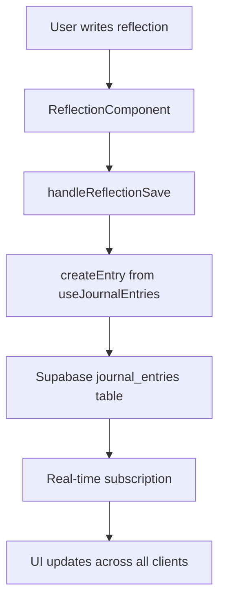

# Journal Integration with Supabase

## Overview

The journal functionality has been fully integrated with Supabase to provide persistent storage, real-time updates, and user-specific data management for journal entries and reflections.

## Features Implemented

### ✅ **Real-time Journal Storage**
- **Persistent Storage**: All journal entries are saved to Supabase database
- **User-specific Data**: Each user can only access their own journal entries
- **Real-time Updates**: Changes sync across all devices instantly
- **Mood Tracking**: Entries can include mood information

### ✅ **Enhanced User Experience**
- **Loading States**: Visual feedback during save/load operations
- **Error Handling**: Comprehensive error messages and retry mechanisms
- **Empty States**: Helpful messages when no entries exist
- **Success Notifications**: Confirmation when entries are saved

### ✅ **Data Management**
- **CRUD Operations**: Create, read, update, and delete journal entries
- **Date Organization**: Entries organized by date with proper formatting
- **Mood-based Icons**: Visual representation based on mood or content
- **Content Validation**: Prevents saving empty entries

## Implementation Details

### **Database Schema**

The journal entries are stored in the `journal_entries` table:

```sql
CREATE TABLE public.journal_entries (
  id UUID DEFAULT gen_random_uuid() PRIMARY KEY,
  user_id UUID REFERENCES public.users(id) ON DELETE CASCADE NOT NULL,
  content TEXT NOT NULL,
  mood TEXT,
  date DATE DEFAULT CURRENT_DATE,
  created_at TIMESTAMP WITH TIME ZONE DEFAULT NOW(),
  updated_at TIMESTAMP WITH TIME ZONE DEFAULT NOW()
);
```

### **Key Components Updated**

#### **1. Journal Page (`app/journal/page.tsx`)**
- **Supabase Integration**: Uses `useJournalEntries` hook for data management
- **Real-time Data**: Fetches entries from Supabase database
- **Loading States**: Shows loading indicators during data operations
- **Empty States**: Displays helpful message when no entries exist
- **Protected Route**: Requires authentication to access

#### **2. Reflection Component (`components/molecules/ReflectionComponent/ReflectionComponent.tsx`)**
- **Loading State**: Added `isLoading` prop for save operations
- **Disabled State**: Prevents multiple saves while processing
- **Visual Feedback**: Shows "Saving..." text during operations

#### **3. Dashboard Integration (`app/dashboard/page.tsx`)**
- **Journal Sync**: Dashboard reflections also save to Supabase
- **Mood Integration**: Uses selected mood from mood selector
- **Consistent Experience**: Same save behavior across all pages

### **Data Flow**



## Usage Examples

### **Saving a Journal Entry**

```typescript
const handleReflectionSave = async (content: string) => {
  if (!user) return
  
  setIsCreating(true)
  try {
    await createEntry({
      user_id: user.id,
      content,
      mood: 'reflective',
      date: new Date().toISOString().split('T')[0],
    })
    
    addNotification({
      type: 'success',
      title: 'Reflection saved!',
      message: 'Your thoughts have been saved to your journal.',
    })
  } catch (error) {
    addNotification({
      type: 'error',
      title: 'Save failed',
      message: 'Failed to save your reflection. Please try again.',
    })
  } finally {
    setIsCreating(false)
  }
}
```

### **Displaying Journal Entries**

```typescript
const { entries, loading, createEntry, updateEntry, deleteEntry } = useJournalEntries()

// Convert Supabase entries to display format
const convertToJournalEntry = (entry: any): JournalEntryType => {
  const icons = [CheckCircle, Cloud, Heart, Sparkles, Sun, Leaf]
  const colors = ['green', 'blue', 'pink', 'purple', 'yellow', 'green']
  
  const moodIndex = entry.mood ? Math.abs(entry.mood.charCodeAt(0)) % icons.length : 0
  
  return {
    id: parseInt(entry.id),
    date: new Date(entry.date).toLocaleDateString('en-US', { 
      year: 'numeric', 
      month: 'long', 
      day: 'numeric' 
    }),
    content: entry.content,
    icon: icons[moodIndex],
    color: colors[moodIndex]
  }
}

const pastReflections = entries.map(convertToJournalEntry)
```

## Real-time Features

### **Automatic Synchronization**
- **Cross-device Sync**: Entries appear instantly on all devices
- **Live Updates**: Changes reflect immediately without refresh
- **Conflict Resolution**: Supabase handles concurrent edits gracefully

### **Subscription Management**
```typescript
// Real-time subscription is handled automatically in useJournalEntries hook
useEffect(() => {
  if (!user) return

  const subscription = realtimeService.subscribeToJournalEntries(user.id, (payload) => {
    if (payload.eventType === 'INSERT') {
      setEntries(prev => [payload.new, ...prev])
    } else if (payload.eventType === 'UPDATE') {
      setEntries(prev => prev.map(e => e.id === payload.new.id ? payload.new : e))
    } else if (payload.eventType === 'DELETE') {
      setEntries(prev => prev.filter(e => e.id !== payload.old.id))
    }
  })

  return () => subscription.unsubscribe()
}, [user])
```

## Security Features

### **Row Level Security (RLS)**
- **User Isolation**: Users can only access their own entries
- **Automatic Filtering**: Database queries automatically filter by user_id
- **Secure Operations**: All CRUD operations respect user permissions

### **Authentication Requirements**
- **Protected Routes**: Journal page requires authentication
- **User Context**: All operations require valid user session
- **Session Validation**: Automatic sign-out for invalid sessions

## Error Handling

### **Database Errors**
- **Connection Issues**: Graceful handling of network problems
- **Permission Errors**: Clear messages for unauthorized access
- **Validation Errors**: User-friendly error messages

### **User Experience**
- **Loading States**: Visual feedback during operations
- **Error Notifications**: Toast notifications for errors
- **Retry Mechanisms**: Users can retry failed operations

## Performance Optimizations

### **Efficient Data Loading**
- **Lazy Loading**: Entries loaded only when needed
- **Pagination Ready**: Structure supports future pagination
- **Optimistic Updates**: UI updates immediately, rolls back on error

### **Real-time Efficiency**
- **Selective Subscriptions**: Only subscribes to user's data
- **Event Filtering**: Database filters events by user_id
- **Automatic Cleanup**: Subscriptions cleaned up on unmount

## Testing Scenarios

### **Basic Functionality**
1. **Create Entry**: Write and save a reflection
2. **View Entries**: See saved entries in the journal
3. **Real-time Sync**: Open multiple tabs, verify sync
4. **Mood Integration**: Test mood-based icon assignment

### **Error Scenarios**
1. **Network Failure**: Test offline behavior
2. **Invalid Data**: Test with empty or invalid content
3. **Permission Issues**: Test with expired session
4. **Concurrent Edits**: Test multiple users editing

### **Edge Cases**
1. **Empty Journal**: Test first-time user experience
2. **Long Content**: Test with very long reflections
3. **Special Characters**: Test with emojis and special text
4. **Date Boundaries**: Test entries across different dates

## Future Enhancements

### **Planned Features**
- **Entry Editing**: Allow users to edit existing entries
- **Entry Deletion**: Add delete functionality
- **Search Functionality**: Search through past entries
- **Export Options**: Export journal as PDF or text
- **Rich Text Support**: Support for formatting and images
- **Tags and Categories**: Organize entries with tags
- **Mood Analytics**: Visualize mood trends over time

### **Performance Improvements**
- **Pagination**: Load entries in batches
- **Caching**: Implement client-side caching
- **Offline Support**: Work without internet connection
- **Image Uploads**: Support for photos in entries

## Migration from Static Data

The journal has been successfully migrated from static mock data to dynamic Supabase storage:

### **Before (Static)**
```typescript
const [pastReflections, setPastReflections] = useState<JournalEntryType[]>([
  // Hardcoded entries
])

const handleReflectionSave = (content: string) => {
  // Local state update only
  setPastReflections(prev => [newEntry, ...prev])
}
```

### **After (Supabase)**
```typescript
const { entries, loading, createEntry } = useJournalEntries()

const handleReflectionSave = async (content: string) => {
  // Database save with real-time sync
  await createEntry({
    user_id: user.id,
    content,
    mood: 'reflective',
    date: new Date().toISOString().split('T')[0],
  })
}
```

## Benefits Achieved

### **Data Persistence**
- ✅ Entries survive browser refreshes
- ✅ Data accessible across devices
- ✅ Automatic backups via Supabase

### **Real-time Collaboration**
- ✅ Instant updates across devices
- ✅ No manual refresh needed
- ✅ Consistent data state

### **User Experience**
- ✅ Loading states and feedback
- ✅ Error handling and recovery
- ✅ Empty states and guidance

### **Security**
- ✅ User-specific data isolation
- ✅ Authentication requirements
- ✅ Secure database operations

The journal integration provides a robust, scalable foundation for personal reflection and journaling with modern real-time capabilities and enterprise-grade security.
